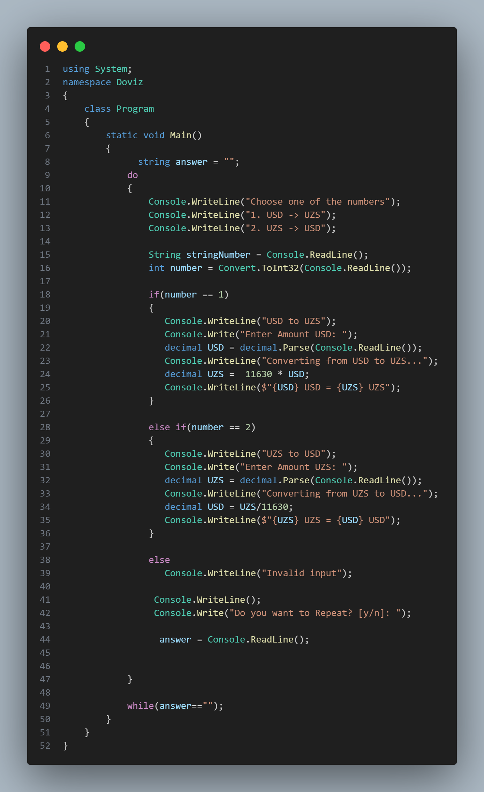

# Doviz
In this version of release,used Switch Case statement 

If you want to see the old version , follow the [link](https://github.com/Stryker9898/Doviz/tree/releases/v1.0) !

## Demo

## Release Notes

### **[v2.0]**(https://github.com/Stryker9898/Doviz/tree/releases/v2.0)

#### New Features
* You can show multiplication table
* Program to ask you to try again

### **[v1.0]**(https://github.com/Stryker9898/Doviz/tree/releases/v1.0)

